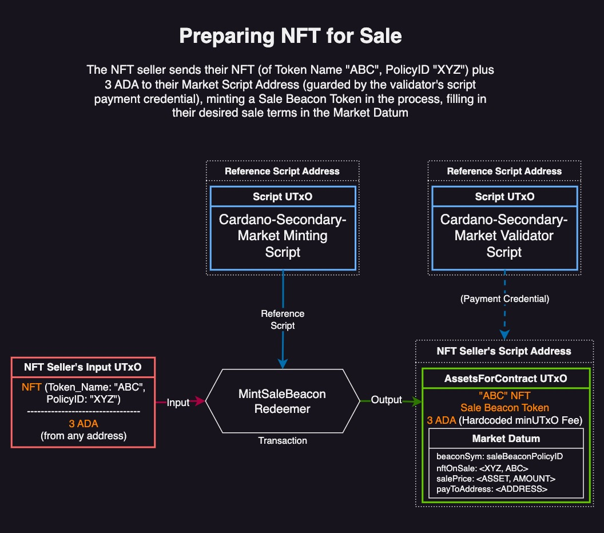
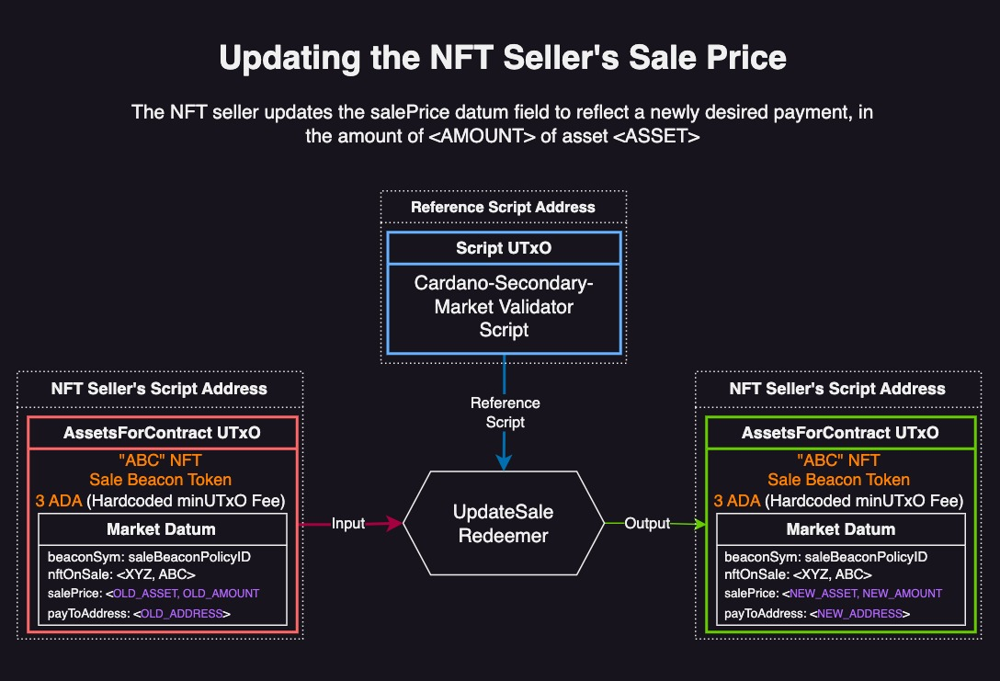
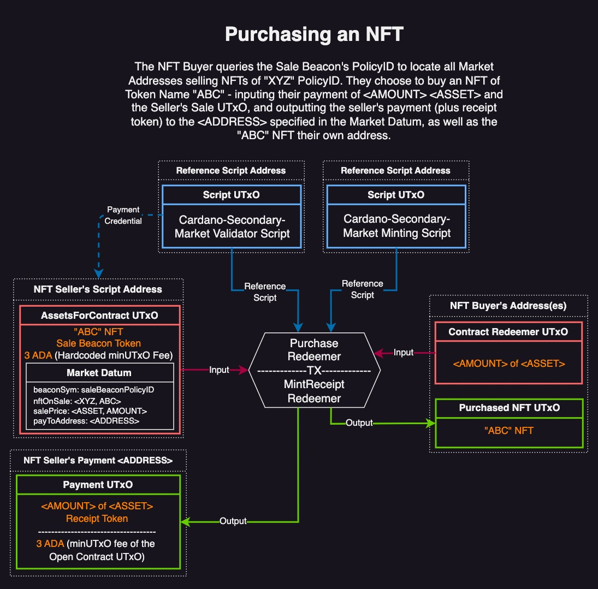
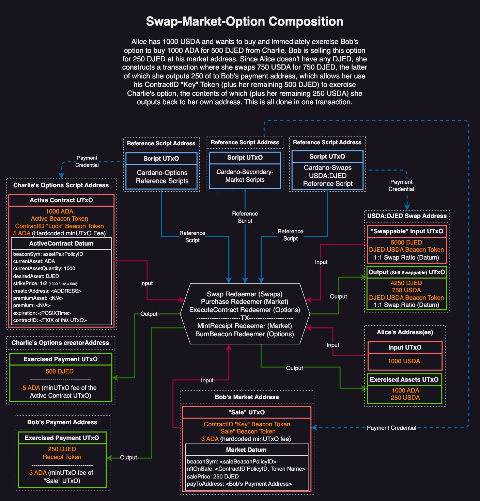

# Cardano-Secondary-Market
A [p2p-DeFi](https://github.com/zhekson1/CSL-DeFi-Protocols) aftermarket protocol for buying/selling NFTs on the Cardano Settlement Layer.

## Table of Contents
- [Abstract](#abstract)
- [Motivation](#motivation)
- [Preliminary Discussion](#preliminary-discussion)
- [Specification](#specification)
- [Features Discussion](#features-discussion)
- [Future Directions](#future-directions)
- [Conclusion](#conclusion)

## Abstract
Cardano-Secondary-Market is a p2p-DeFi protocol for trading NFTs on the Cardano Settlement Layer (CSL). Users deploy and interact with each others' script addresses, creating a permissionless and high-availability NFT aftermarket. 

## Motivation
Secondary Markets (a.k.a. aftermarkets) play a crucial role in enhancing the efficiency and dynamism of an economy, particularly in the DeFi space. Current NFT aftermarket solutions on Cardano rely on centralized entities for listing and finding assets. This introduces an availability bottleneck; centralized entities cannot guarantee the same level of uptime as the underlying blockchain. This is especially concerning for financial NFTs whose value is greatly impacted by time. Furthermore, although current NFT aftermarkets are non-custodial, they lack composability with other DeFi protocols. Since transaction space is limited, composability is critical for scaling throughput in eUTxO-style ledgers like Cardano. 

## Preliminary Discussion
A robust NFT aftermarket is an essential cornerstone of a DeFi ecosystem. This is especially true for "Financial" NFTs, whose purpose is to control access to some underlying locked asset(s) (i.e. Option or Loan "Key" Tokens). A financial NFT's' value may be highly dependent on time, as in the case of options or lending/borrowing protocols. The viability of such protocols greatly depends on users' confidence that a secure aftermarket is *always* available for trading. Therefore, any DeFi protocol with time-dependent mechanics can only ever be as robust as the most robust aftermarket protocol. As a member of the [p2p-DeFi protocol family](https://github.com/zhekson1/CSL-DeFi-Protocols), Cardano-Secondary-Market provides the strongest availability and censorship-resistance guarantees of any aftermarket protocol. 

Cardano-Secondary-Market is also a highly composable protocol. NFT buyers can use outputs from other (composable) protocols as payment inputs, and the resultant NFT outputs can be inputs to other (composable) protocols, all in a single transaction (limited by Cardano parameters for max Tx size). Composing DeFi protocols yields significant increases in throughput and decreases in total Tx fees - essential for eUTxO style ledgers. An example of a complex transaction involving Cardano-Secondary-Market, Cardano-Swaps, and Cardano-Options is shown in the [Features Discussion](#features-discussion) section below. 


### Lock and Key NFTs
Lock and Key NFTs are an extension of the Beacon Token pattern, and are used throughout Cardano-Loans, Cardano-Options, and potentially other p2p-DeFi protocols. They serve two purposes: 
- As "Beacons" for permissionlessly querying information about each other
- As a "Pair" for locking/unlocking financial UTxOs.

Key Tokens can be freely traded while the Lock Tokens are kept in the underlying locked UTxOs. Key Tokens are especially well-suited for trading on Cardano-Secondary-Market (as opposed to other marketplaces), because:
- Their value is time-dependent, as explained above
- As products of p2p-DeFi protocols, they inherit all of the same composability and availability benefits as this protocol.

For example, in Cardano-Options, when an options contract is purchased, one lock and one key NFT with identical Token Names and policyIDs are created. One stays with the assets at the script address (this is the "Lock" NFT) and the other can be freely traded (this is the "Key" NFT). To exercise the option, both the lock and key are required to be present in the TX inputs. Since the two are identical, the Key information can always be used to find the location of the corresponding Lock, and in turn the parameters of the underlying contract. Therefore, buyers looking to purchase aftermarket options contracts can easily sort all available options of a given asset-pair (by PolicyID), and then query individual contract parameters (by the Key's Token Name), all prior to actually buying the Key Token. 


### The Cardano-Secondary-Market Protocol
Users buy/sell NFTs from each other, fully p2p.

##### **The protocol is broadly comprised of two steps:**

1. **Creating a Sale** - Alice puts her NFT (of Token Name "ABC" and policyID "XYZ") up for sale by outputting (to her "Sale" script address) a UTxO containing her "ABC" NFT, a "Sale" Beacon Token, and a datum with her desired payment information.
   
2. **Buying an NFT** - Bob queries a list of all NFTs of policyID "XYZ" that are for sale, and decides to purchase Alice's "ABC" NFT. He submits a transaction that consumes Alice's "Sale" UTxO and pays her according to the UTxO's datum, in exchange for the right to output her "ABC" NFT.

## Specification
The protocol is composed of one validator script and multiple minting policies that work together. All trades, no matter how different the terms, use the same validator script. Minting policies are unique for every policyID, meaning a family of NFTs that all share the same policyID (i.e. Spacebudz) can all share one minting policy on Cardano-Secondary-Markets. The number of minting policies scales 1:1 with the number of unique policyIDs being traded.

### Components
An outline of the addresses, tokens, datums, and redeemers used in Cardano-Secondary-Market.

#### Unique Beacon Policies
Unique Beacon minting policies are required for every unique NFT policyID. This helps to enforce protocol logic, but also enables users to easily sort through whats on sale, based on policyIDs. For example, all Spacebudz NFTs have the same policyID, so users can easily query all such NFTs that are currently for sale on Cardano-Secondary-Market. In the case of Cardano-Options "Key" Tokens, all "call" options for ADA, priced in DJED, will have the same policyID. Key tokens for AGIX options, priced in DJED, will have a different policyID.

#### Universal Validator Script
Since the beacons serve to sort the sales of different items, there is no reason to give each market its own family of addresses. Therefore, all Cardano-Secondary-Market users will use the same validator script no matter what NFT is being sold. The validator is capable of enforcing the sales occur as they should.

#### Sale Beacon Token
The `Sale` Beacon Token serves to "tag" NFTs with unique policyIDs, as well as in mediating the control flow of the protocol. `Sale` Beacons are minted and included in every "Sale" UTxO containing an NFT, and are burned whenever a sale is purchased or closed.

#### Receipt Token
The `receipt` token is a special (non-Beacon) token used to prevent double satisfaction during a sale. In summary, when an NFT is sold, buyers must output payment to an address specified by the seller in the "Sale" UTxO's datum field. If multiple purchases are composed in one transaction, the outputs may not be unique, risking double satisfaction. To prevent this, the protocol enforces that for every `Sale` Beacon among a transaction's inputs, there is also a `receipt` token minted and included in the corresponding payment outputs. The `receipt` token's Token Name is the TxHash of the corresponding "Sale" UTxO being consumed, which guarantees the uniqueness of payment outputs and prevents double satisfaction. 

> **Note**
> Each protocol in the p2p-DeFi Family uses a different method for handling double satisfaction. This was to experiment with different possible solutions/tradeoffs. In time, the family will likely converge on a single method with the best set of trade-offs.

#### The "Sale" Datum
The `Sale` datum is used in the "Sale" UTxO to enforce the seller's terms. The datum is introduced here, and expanded upon in the Lifecycle section below.

``` Haskell
data MarketDatum = MarketDatum 
  { -- | The currency symbol of the market beacon policy for this NFT.
    beaconSymbol :: CurrencySymbol
  
    -- | The currency symbol of the NFT must match what the minting policy expects. The minting
    -- of the Sale beacon will fail if the NFT has the wrong currency symbol.
  , nftOnSale :: (CurrencySymbol,TokenName)

    -- | The desired currency with its relative value.
    -- The relative values are always desiredCurrency/NFT. Since there is only one
    -- NFT, the denominator is always one. So the relative values can be simplified
    -- to just an integer.
  , salePrice :: ((CurrencySymbol,TokenName),Integer)

    -- | Address where payment should go to. Since there is no way to specify a datum,
    -- this address must use a pubkey for the payment credential. The staking credential
    -- can be anything, including none.
  , payToAddress :: Address
  }
```

>**Note**
>V1 of Cardano-Secondary-Market only allows a single asset to be specified in the `salePrice`. Since this protocol is composable with `cardano-swaps`, stablecoins can easily be converted between each other in the same transaction where the NFT is being purchased.

#### MarketConfig Parameter
The `MarketConfig` is an extra parameter for the minting policy to create a unique beacon policies for every policyID, (i.e. all Option "Key" Tokens of a given asset-pair).

```Haskell
type MarketConfig = CurrencySymbol
```

#### Validator Redeemers
Validator redeemers are introduced here, their usage is explained further below.

``` Haskell
data MarketRedeemer
  = CloseSale -- ^ Seller action.
  | UpdateSale -- ^ Seller action.
  | Purchase -- ^ Buyer action.
```

#### Beacon Minting Redeemers
Minting redeemers are introduced here, their usage is explained further below.

``` Haskell
data MarketBeaconRedeemer
  = MintSaleBeacon
  | MintReceiptTokens
  | BurnBeacons
```
> **Note**
> Receipt Tokens are not technically Beacons. They are used to guarantee uniqueness of payment outputs, thereby preventing double satisfaction.

------

### Secondary-Market Lifecycle
Below is an in-depth look at Cardano-Secondary-Market logic.

#### 1. Creating a Sale
Creating a new sale involves minting a `Sale` Beacon and storing it with the NFT for sale at the user's marketplace address with the terms in the datum.



Minting a `Sale` beacon requires the `MintSaleBeacon` redeemer and all the following must be true:
1. Only one `Sale` beacon can be minted this transaction.
2. The `Sale` beacon must have the token name "Sale".
3. No other tokens can be minted by this marketplace policy.
4. The `Sale` beacon must go to an address using the marketplace validator as the payment credential.
5. The `Sale` beacon must go to an address with a staking credential.
6. The `Sale` beacon must be stored with the proper inline `MarketDatum`:
      - `beaconSymbol` == this policy id
      - the currency symbol for nftOnSale == currency symbol in `MarketConfig`
      - `nftOnSale` == the NFT stored in the UTxO
      - the salePrice > 0
      - the `payToAddress` must use a payment pubkey
7. The `Sale` beacon must be stored with the proper value:
      - 3 ADA + nft for sale + `Sale` beacon
      - no other assets

##### Closing an open Sale
Closing an open sale involves burning the `Sale` beacon and reclaiming the NFT. Only the marketplace address owner can use this redeemer. Multiple open sales can be closed in a single transaction.


To close a sale, both the `CloseSale` and `BurnBeacons` redeemers are required. The following must all be true:

1. All `Sale` beacons among the tx inputs must be burned.
2. The address' staking credential must signal approval.


#### 2. Updating an Open Sale
It is possible to update an open sale in place. Only the address owner can do this. To update the terms of an open sale, the `UpdateSale` redeemer must be used and all the following must be true:



1. There can only be one `Sale` beacon among the transaction inputs.
2. The `Sale` beacon must be in the UTxO being updated.
3. No `Sale` beacons can be minted this transaction.
4. The `Sale` beacon must be re-output to the same address.
5. The output must have a valid inline `MarketDatum`:
	- `beaconSymbol` must be the same as the input's datum
	- `nftOnSale` must be the same as the input's datum
	- `salePrice` (new) must be > 0
	- `payToAddress` (new) must use a payment pubkey
1. The output must have the proper value:
      - 3 ADA + NFT for sale + `Sale` beacon
      - no other assets
2. The address' staking credential must signal approval (via key or script).

The first three requirements guarantee that each sale will have a unique transaction hash, which is required to compose purchases. The trade-off here is that only one sale can be updated per transaction.

#### 3. Purchasing an NFT
Purchasing an NFT involves minting a `Receipt` Token, burning the `Sale` beacon, and sending the required payment to the `payToAddress` in the sale datum.



The `Purchase` redeemer and `MintReceiptToken` redeemers must be used, and all the following must be true:
1. A `receipt` token is minted with the token name being the transaction hash of the target sale UTxO being input.
2. There must be at least one valid sale input in the transaction, demarcated by the presence of a `Sale` beacon.
3. Every payment output must satisfy the `salePrice` and `payToAddress` requirements of the corresponding sale input(s) datum.
4. Every `Sale` Beacon among the transaction inputs must be burned.
5. The `receipt` token(s) for each sale input must be minted and included in the corresponding payment output(s).
6. No other tokens can be minted by the market beacon policy.

The marketplace minting policy does all of the necessary checks; the marketplace validator just needs to ensure the minting policy is executed by checking that the required `receipt` token is minted for each "sale" UTxO being spent. By pushing the heavy logic into the minting policy, the impact of redundant executions is greatly minimized.

### Fee Estimations (YMMV)
| Action | Tx Fee |
|--|--|
| Create a New Sale | 0.50613 ADA |
| Update a Sale | 0.526772 ADA |
| Close a Sale | 0.666328 ADA |
| Purchase an NFT | 0.736944 |
| Burn a Receipt Token | 0.389625 ADA |

During testing, it was possible to purchase 4 NFTs under the same policy before exceeding the transaction limits. Mixing NFTs of different policies will result in less total NFTs since each policy will require the appropriate minting script to be included in the transaction as well. Using reference scripts instead of local scripts can yield better results.


## Features Discussion
A discussion of features unique to Cardano-Secondary-Market.

### NFT Sub-Market Formation
Cardano-Secondary-Market can be used to trade any type of NFT, not just "Financial" types. Art, gaming, or any other tokens are compatible. As explained in the [specification](#specification) above, Cardano-Secondary-Market uses a unique minting policy for every unique NFT policyID. As Cardano adoption grows, and new NFT minting standards are widely adopted, this protocol is well-positioned to handle the formation of entire NFT sub-markets. For example, if the country of Ethiopia standardizes a real-estate token minting policy on Cardano, then all Ethiopian Real-Estate NFTs could be queryable and trade-able via a single Cardano-Secondary-Market minting policy. 

### Composable Purchases
Since the output of every sale is guaranteed to be unique, multiple purchases can be composed in a single transaction with no risk of double satisfaction. This includes purchases of NFTs with different policyIDs. For example, one can buy an option "Key" token, a Loan "Key" Token, and a Spacebudz NFT all in one transaction.

### Composability with other DeFi Protocols
Cardano-Secondary-Market is composable with other protocols, such as Cardano-Swaps and Cardano-Options. For example, when buying an Option "Key" Token on the market, it can be used to exercise the underlying option contract, all in one transaction. Furthermore, the payment for the Option "Key" Token can come from a Cardano-Swaps output. Below is an example of such complex composition.



## Future Directions
V1 of Cardano-Secondary-Market is intended to demonstrate the capacity for a fully p2p NFT aftermarket on the CSL. As such, there are a number of features that may be implemented in future versions of the protocol, discussed below.

### Updating Multiple Sales
Currently, only one sale can be updated per transaction. Future versions of Cardano-Secondary-Market may enable batch-updating of sales. This would lower fees and increase throughput of the protocol.

### Batch Sales
Currently, only one NFT can be sold per "Sale" UTxO. Future versions of Cardano-Secondary-Market may enable "batch selling" of NFTs that have the same policyID. For example, with batch sales, an NFT seller could put multiple Spacebudz up for sale in a single UTxO, for the purpose of a "batched" all-or-nothing sale. 

### Script-based Payment Addresses
With further optimizations to Plutus Core, more efficient languages, increased execution limits, or all three, it may be possible to enforce that the option exerciser outputs payments to the writer with proper datums. Alternatively, Plutus Core may be updated such that scripts may be executed even if there is no datum.

### Bids
Bids are an essential feature for aftermarkets, especially for unique art or gaming NFTs. Future versions of Cardano-Secondary-Markets may enable a toggle-able "bid" feature, where bidders can send "Bid" UTxOs to the seller's market address, leaving the final sale decision up to the seller.

> **Note**
> This feature will likely introduce a significant amount of new logic to the protocol, and may warrant a partial or complete rewrite.

## Conclusion
Cardano-Secondary-Market is a vital addition to the [p2p-DeFi protocol family](https://github.com/zhekson1/CSL-DeFi-Protocols). It enables the formation of a radically permissionless and highly composable NFT marketplace on the CSL, and works synergistically with other p2p-DeFi protocols. 